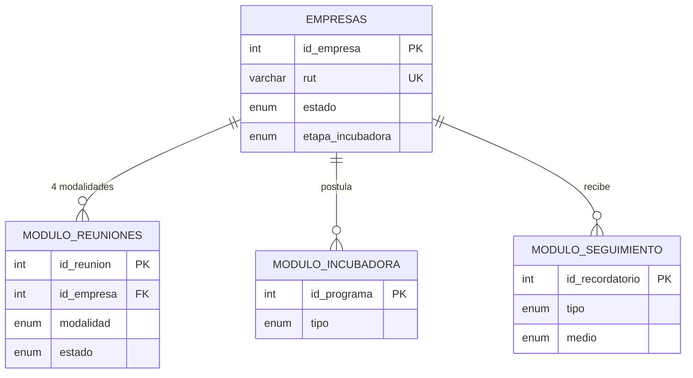
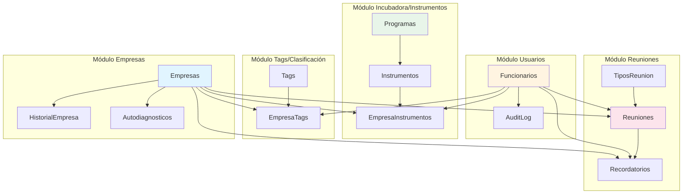
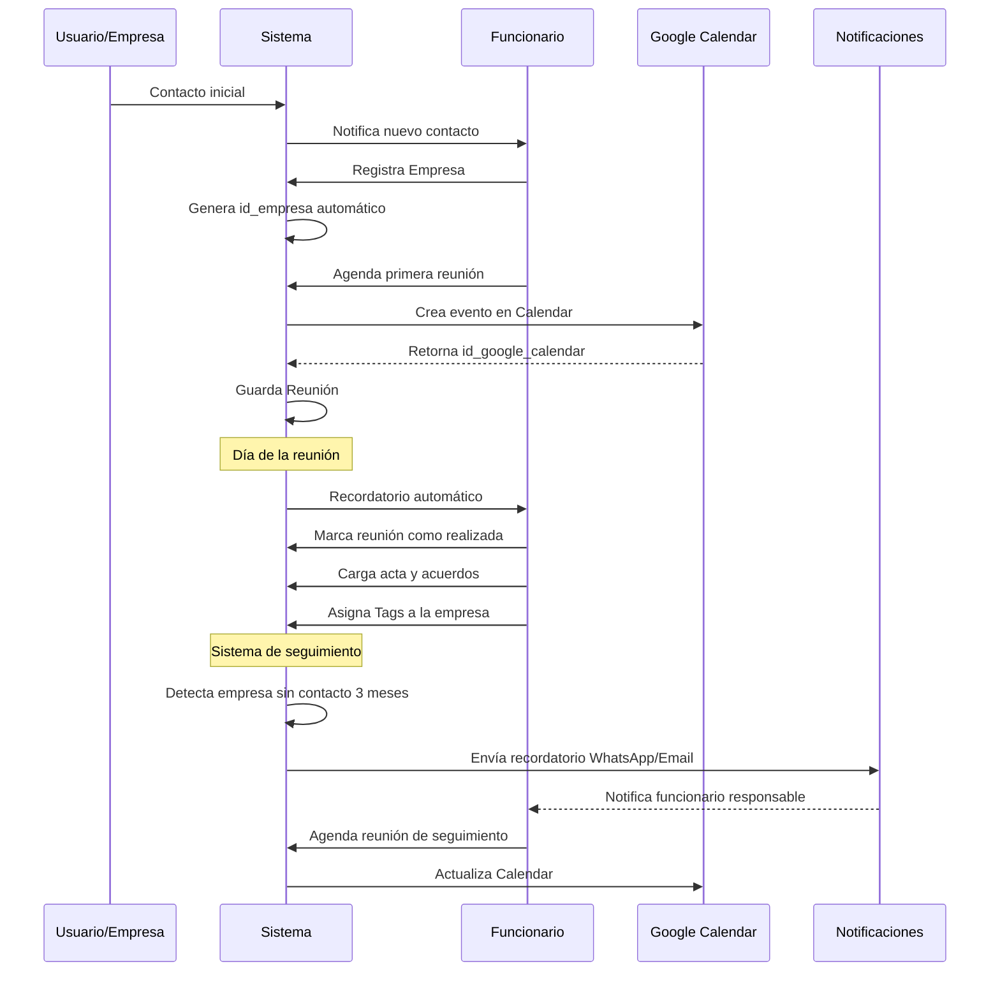

# Diagrama MER - Sistema Salto Innova

## Visualización del Modelo Entidad-Relación

Para visualizar este diagrama:

- **VS Code**: Instala la extensión "Markdown Preview Mermaid Support"
- **GitHub**: Se renderiza automáticamente
- **Navegador**: Copia el código en [mermaid.live](https://mermaid.live)

---

## Diagrama Principal

```mermaid
erDiagram
    Empresas ||--o{ HistorialEmpresa : "tiene historial"
    Empresas ||--o{ Reuniones : "participa en"
    Empresas ||--o{ EmpresaTags : "tiene"
    Empresas ||--o{ EmpresaInstrumentos : "postula a"
    Empresas ||--o{ Recordatorios : "recibe"
    Empresas ||--o{ Autodiagnosticos : "completa"

    Funcionarios ||--o{ Reuniones : "gestiona"
    Funcionarios ||--o{ EmpresaTags : "asigna"
    Funcionarios ||--o{ EmpresaInstrumentos : "gestiona"
    Funcionarios ||--o{ Recordatorios : "crea"
    Funcionarios ||--o{ Autodiagnosticos : "revisa"
    Funcionarios ||--o{ AuditLog : "genera"
    Funcionarios ||--o{ FuncionarioUnidades : "trabaja en"

    UnidadesAtencion ||--o{ Reuniones : "aloja"
    UnidadesAtencion ||--o{ FuncionarioUnidades : "tiene asignados"
        varchar direccion "Dirección física"
        varchar telefono "Contacto telefónico"
        varchar email "Email principal"
        datetime fecha_registro "Fecha de alta"
        enum estado "pre-cliente, cliente, inactivo, cerrado, expandido"
        enum etapa_incubadora "ninguna, idea, validacion, ejecucion, asesoria"
        varchar responsable_empresa "Contacto principal"
        varchar cargo_responsable "Cargo del contacto"
        text observaciones "Notas adicionales"
    }

    HistorialEmpresa {
        int id_historial PK "Identificador único"
        int id_empresa FK "Referencia a Empresas"
        year anio UK "Año del registro"
        decimal facturacion "Facturación anual USD"
        int cantidad_empleados "Número de empleados"
        enum area_innovacion "marketing, finanzas, tics, comercial, etc"
        text observaciones "Notas del período"
        datetime fecha_registro "Cuándo se registró"
    }

    Funcionarios {
        int id_funcionario PK "Identificador único"
        varchar username UK "Usuario de login"
        varchar password_hash "Contraseña encriptada"
        varchar nombre_completo "Nombre del funcionario"
        varchar email UK "Email corporativo"
        enum rol "admin, coordinador, asesor, recepcion"
        boolean activo "Usuario activo"
        datetime fecha_alta "Fecha de ingreso"
        datetime ultimo_login "Último acceso"
    }

    TiposReunion {
        int id_tipo_reunion PK "Identificador único"
        varchar nombre UK "primer_contacto, seguimiento, derivacion"
        text descripcion "Descripción del tipo"
        boolean requiere_seguimiento "Genera recordatorios"
    }

    UnidadesAtencion {
        int id_unidad PK "Identificador único"
        varchar nombre UK "Nombre de la unidad"
        enum tipo "fisica, virtual"
        varchar direccion "Dirección física"
        varchar ciudad "Salto, Guaviyu de Arapey, etc"
        varchar telefono "Teléfono contacto"
        varchar email "Email de la unidad"
        varchar horario_atencion "Horarios de atención"
        int capacidad_simultanea "Reuniones simultáneas"
        boolean activo "Unidad operativa"
        text observaciones "Notas adicionales"
    }

    FuncionarioUnidades {
        int id_func_unidad PK "Identificador único"
        int id_funcionario FK "Funcionario asignado"
        int id_unidad FK "Unidad de atención"
        datetime fecha_asignacion "Cuándo fue asignado"
        boolean es_responsable "Si es responsable"
    }

    Reuniones {
        int id_reunion PK "Identificador único"
        int id_empresa FK "Empresa involucrada"
        int id_funcionario FK "Funcionario responsable"
        int id_tipo_reunion FK "Tipo de reunión"
        int id_unidad FK "Unidad donde se realiza"
        datetime fecha_hora "Fecha y hora programada"
        enum modalidad "presencial, telefonica, online, en_empresa"
        int duracion_minutos "Duración en minutos"
        enum estado "programada, realizada, cancelada, reprogramada"
        text agenda "Temas a tratar"
        text acta "Resumen de lo tratado"
        text acuerdos "Compromisos acordados"
        varchar id_google_calendar "ID evento Google Calendar"
        date proximo_contacto "Fecha próxima reunión"
    }

    Tags {
        int id_tag PK "Identificador único"
        varchar nombre UK "Nombre del tag"
        enum categoria "problema, necesidad, oportunidad, riesgo"
        varchar color "Color hex para UI"
        boolean activo "Tag disponible"
    }

    EmpresaTags {
        int id_empresa_tag PK "Identificador único"
        int id_empresa FK "Empresa etiquetada"
        int id_tag FK "Tag asignado"
        int id_funcionario FK "Quién asignó"
        datetime fecha_asignacion "Cuándo se asignó"
        text observaciones "Contexto del tag"
    }

    Programas {
        int id_programa PK "Identificador único"
        varchar nombre UK "Nombre del programa"
        text descripcion "Descripción detallada"
        enum tipo "incubadora, innovacion, financiero, capacitacion"
        date fecha_inicio "Inicio del programa"
        date fecha_fin "Fin del programa"
        boolean activo "Programa disponible"
        varchar poa_vinculado "Código POA"
    }

    Instrumentos {
        int id_instrumento PK "Identificador único"
        int id_programa FK "Programa al que pertenece"
        varchar nombre "Nombre del instrumento"
        text descripcion "Detalles del instrumento"
        text requisitos "Requisitos de aplicación"
        decimal monto_disponible "Monto económico"
        date fecha_apertura "Desde cuándo aplicar"
        date fecha_cierre "Hasta cuándo aplicar"
        boolean activo "Instrumento disponible"
    }

    EmpresaInstrumentos {
        int id_empresa_instrumento PK "Identificador único"
        int id_empresa FK "Empresa postulante"
        int id_instrumento FK "Instrumento solicitado"
        int id_funcionario FK "Funcionario gestor"
        datetime fecha_postulacion "Fecha de postulación"
        enum estado "en_proceso, aprobado, rechazado, desistido, finalizado"
        decimal monto_aprobado "Monto aprobado"
        date fecha_resolucion "Fecha de decisión"
        text observaciones "Notas del proceso"
    }

    Recordatorios {
        int id_recordatorio PK "Identificador único"
        int id_reunion FK "Reunión relacionada opcional"
        int id_empresa FK "Empresa objetivo"
        int id_funcionario FK "Funcionario responsable"
        enum tipo "reunion_proxima, seguimiento, documento_pendiente"
        enum medio "email, whatsapp, ambos"
        datetime fecha_envio "Cuándo enviar"
        text mensaje "Contenido del recordatorio"
        enum estado "pendiente, enviado, fallido, cancelado"
        datetime fecha_envio_real "Cuándo se envió"
        text error_mensaje "Motivo de fallo"
    }

    Autodiagnosticos {
        int id_autodiagnostico PK "Identificador único"
        int id_empresa FK "Empresa que completó"
        datetime fecha_realizado "Cuándo se completó"
        json respuestas_json "Respuestas en JSON"
        int puntaje_total "Score 0-100"
        text areas_oportunidad "Áreas para mejorar"
        text recomendaciones "Recomendaciones automáticas"
        int revisado_por FK "Funcionario revisor"
        datetime fecha_revision "Cuándo fue revisado"
    }

    AuditLog {
        int id_log PK "Identificador único"
        int id_funcionario FK "Usuario que ejecutó"
        varchar tabla_afectada "Tabla modificada"
        int id_registro "ID del registro"
        enum accion "INSERT, UPDATE, DELETE, LOGIN, LOGOUT"
        json datos_anteriores "Estado previo"
        json datos_nuevos "Estado nuevo"
        varchar ip_address "IP del usuario"
        datetime timestamp "Momento de la acción"
    }
```

---

## Diagrama Simplificado - Vista de Módulos



---

## Cardinalidades Detalladas

### Relaciones Principales

| Relación                           | Cardinalidad | Descripción                                                    |
| ---------------------------------- | ------------ | -------------------------------------------------------------- |
| Empresas → HistorialEmpresa        | 1:N          | Una empresa tiene múltiples registros históricos (uno por año) |
| Empresas → Reuniones               | 1:N          | Una empresa participa en múltiples reuniones                   |
| Funcionarios → Reuniones           | 1:N          | Un funcionario gestiona múltiples reuniones                    |
| TiposReunion → Reuniones           | 1:N          | Un tipo clasifica múltiples reuniones                          |
| Empresas → EmpresaTags             | 1:N          | Una empresa puede tener múltiples tags                         |
| Tags → EmpresaTags                 | 1:N          | Un tag puede aplicarse a múltiples empresas                    |
| Reuniones → Recordatorios          | 1:N          | Una reunión puede generar múltiples recordatorios              |
| Programas → Instrumentos           | 1:N          | Un programa contiene múltiples instrumentos                    |
| Instrumentos → EmpresaInstrumentos | 1:N          | Un instrumento puede tener múltiples postulaciones             |
| Empresas → Autodiagnosticos        | 1:N          | Una empresa puede completar múltiples autodiagnósticos         |

### Restricciones Importantes

- **UNIQUE(id_empresa, anio)** en HistorialEmpresa - Solo un registro por empresa por año
- **UNIQUE(id_empresa, id_tag)** en EmpresaTags - Evita tags duplicados
- **CASCADE DELETE** en relaciones críticas (historial, tags)
- **SET NULL** en revisiones de autodiagnósticos si funcionario se elimina

---

## Vista por Módulos Funcionales



---

## Atributos Clave por Entidad

### 🏢 Empresas (Núcleo del Sistema)

- **PK**: `id_empresa`
- **UK**: `rut` (único en Uruguay)
- **Estados**: pre-cliente → cliente → inactivo/cerrado/expandido
- **Etapas**: ninguna → idea → validación → ejecución → asesoría
- **Críticos**: facturación, cantidad empleados (vía HistorialEmpresa)

### 👥 Funcionarios (Control de Acceso)

- **PK**: `id_funcionario`
- **UK**: `username`, `email`
- **Roles**: admin > coordinador > asesor > recepción
- **Seguridad**: password_hash (bcrypt), último_login

### 📅 Reuniones (Actividad Principal)

- **PK**: `id_reunion`
- **FKs**: id_empresa, id_funcionario, id_tipo_reunion
- **Modalidades**: presencial | telefónica | online | en_empresa
- **Estados**: programada → realizada | cancelada | reprogramada
- **Integración**: id_google_calendar para sincronización

### 🏷️ Tags (Sistema de Clasificación)

- **PK**: `id_tag`
- **Categorías**: problema | necesidad | oportunidad | riesgo
- **Ejemplos**: financiamiento, marketing-digital, exportación

### 📊 HistorialEmpresa (Métricas Temporales)

- **PK**: `id_historial`
- **UK**: (id_empresa, anio) - Un registro por empresa por año
- **Métricas**: facturación, empleados, área_innovación
- **Propósito**: Análisis de evolución multi-año

### 🔔 Recordatorios (Seguimiento Automático)

- **PK**: `id_recordatorio`
- **Medios**: email | whatsapp | ambos
- **Estados**: pendiente → enviado | fallido | cancelado
- **Trigger**: Sistema cron/scheduler ejecuta recordatorios pendientes

### 📝 Autodiagnosticos (Evaluación Inicial)

- **PK**: `id_autodiagnostico`
- **Almacenamiento**: JSON para respuestas flexibles
- **Score**: 0-100 calculado automáticamente
- **Output**: recomendaciones personalizadas

### 🎯 Programas e Instrumentos (Oferta Institucional)

- **Relación**: 1 Programa → N Instrumentos
- **Tipos**: incubadora | innovación | financiero | capacitación
- **Tracking**: EmpresaInstrumentos registra postulaciones

### 🔒 AuditLog (Seguridad y Compliance)

- **PK**: `id_log`
- **Capturas**: INSERT, UPDATE, DELETE, LOGIN, LOGOUT
- **Datos**: JSON con estado anterior/nuevo
- **Retención**: Mínimo 1 año por normativas

---

## Flujo de Datos Típico



---

## Índices Recomendados

### Performance Crítico

```sql
-- Búsquedas frecuentes
CREATE INDEX idx_empresa_rut ON Empresas(rut);
CREATE INDEX idx_empresa_estado ON Empresas(estado);
CREATE INDEX idx_reunion_fecha ON Reuniones(fecha_hora);
CREATE INDEX idx_reunion_empresa_fecha ON Reuniones(id_empresa, fecha_hora);

-- Seguimiento y recordatorios
CREATE INDEX idx_recordatorio_fecha_estado ON Recordatorios(fecha_envio, estado);
CREATE INDEX idx_historial_empresa_anio ON HistorialEmpresa(id_empresa, anio);

-- Auditoría
CREATE INDEX idx_audit_funcionario_fecha ON AuditLog(id_funcionario, timestamp);
CREATE INDEX idx_audit_tabla ON AuditLog(tabla_afectada);
```

---

## Reglas de Negocio en el Modelo

1. **Una empresa no puede tener dos registros históricos para el mismo año**  
   → UNIQUE(id_empresa, anio) en HistorialEmpresa

2. **Un funcionario no puede tener dos usuarios con el mismo username**  
   → UNIQUE(username) en Funcionarios

3. **Una empresa no puede tener el mismo tag duplicado**  
   → UNIQUE(id_empresa, id_tag) en EmpresaTags

4. **Los recordatorios pendientes deben procesarse automáticamente**  
   → Job scheduler consulta WHERE estado='pendiente' AND fecha_envio <= NOW()

5. **Toda modificación crítica debe auditarse**  
   → Triggers en Empresas, Reuniones, Funcionarios → INSERT en AuditLog

6. **Las reuniones deben sincronizarse con Google Calendar**  
   → Campo id_google_calendar + API integration layer

7. **Los instrumentos solo pueden postularse si están activos**  
   → CHECK(activo = TRUE) antes de INSERT en EmpresaInstrumentos

---

## Cómo Visualizar

### Opción 1: VS Code

1. Instala: **Markdown Preview Mermaid Support**
2. Abre este archivo
3. Presiona `Ctrl+Shift+V` (preview)

### Opción 2: Navegador Web

1. Visita: https://mermaid.live
2. Copia el código entre ` ```mermaid ` y ` ``` `
3. Ver/editar en tiempo real

### Opción 3: GitHub

- Sube este archivo a GitHub
- Se renderiza automáticamente

### Opción 4: dbdiagram.io

Si prefieres una herramienta más interactiva, puedo generar también en formato DBML.

---

_Diagrama generado: 4 de febrero de 2026_  
_Compatible con: Mermaid.js v10+_
